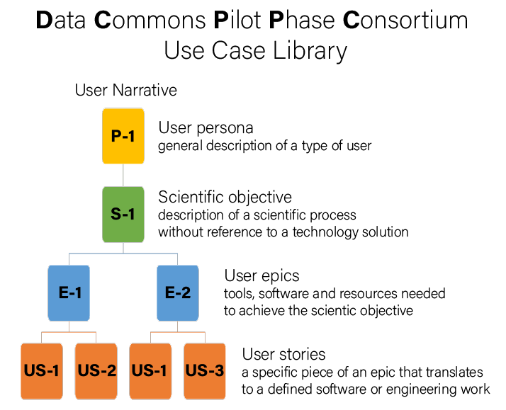

# Use Case Library Glossary

The Use Case Library consists of a set of **user narratives**. Each
narrative captures one set of highly-related scientific objectives and
is achieved by a series of **user epics**. Each epic is enabled by a
set of **user stories**, which are technically-focused details about
how to achieve that epic.  User stories will often be shared among
different epics.

The Use Case Library also provides a set of high level **summaries** that
capture the essential scientific objectives and place them in the context
of larger goals and the Consortium timelines.

### Discussion

First, "use cases" and "user narratives" seem to each be terms that
various members of the consortium use to capture a single collection
of each of the three items below. So I'd suggest we stay away from
using either term to represent a specific piece of this
hierarchy. Additionally, "use case" historically refers to something
lower in the hierarchy that can be verified (did it meet the spec) but
not necessarily validated (is the spec, and therefore the solution,
valuable).  Let's refer to the entire thing as a "user narrative."
Another term commonly used in the field (but we haven't yet used) is
"user scenario." I'd prefer sticking with something that people have
heard before, so let's go with "user narrative."

Second, we need a set lexicon for representing different types of
users that are meaningful and in scope for our purposes. A general
purpose description of a type of user is called a persona, but we
should refer to them as a user in the narratives by saying "a
<persona>." For example, "an analyst" is a specific user of persona
"analyst." (think class in OOP. Sorry for the geekery.) In some cases
we might want to say "an analyst who wants to do..." to be more
specific.

### Definitions

**Scientific objective:** a description of a scientific process, told
without reference to a specific technology solution. Focuses on
resources required, method(s) followed, and outcome(s) targeted. Can
be validated with scientific stakeholders (is this valuable as
written? Yes or no.)  *Note:* These are not currently represented
explicitly in the use case library.

**User epic:** a story, told from the user's perspective that captures a
valuable set of interactions with tools (e.g. software solutions) in
the service of achieving the scientific objective. Must be written in
terms that are meaningful to the user, preferably from their
perspective. Should include mentions of everything the user needs to
achieve their goal, even interactions that don't involve the software
or data we're designing. Can be validated with project leadership (Is
this valuable as written? Yes or no.) and verified with engineering
leadership (Did we deliver it in a way that fits this scenario? Yes or
no.)

**User story:** a specific piece of an epic that translates to a
well-scoped and defined piece of software or data engineering
work. Can be verified with engineering teams (Did we deliver it? Yes
or no.) Certain stories are likely to appear in multiple epics and
should not be duplicated if possible.

### How to write and an EPIC

Each EPIC needs to be a big task **from a user perspective**, like "build a dataset" or "analyze a dataset" or "turn raw sequence into called variants".

Then you take each EPIC, and break it down into small component parts...as if you're writing code...or instructions for a new undergrad, and those are your USER STORYs. In 90% of cases, each USER STORY will have two inputs, and the "output" from the first USER STORY in an EPIC will be one of the two 'inputs' of your second USER STORY in an EPIC. And in most cases, the last "output" from one EPIC should be one of the "inputs" for the next and the "task" needs to be an action. 

The idea is TASK happens to `INPUT_A` + `INPUT_B` = `OUTPUT`

You also shouldn't end up with a bunch of EPICs that are all one step each. EPICs are multistep things, and each of their steps is a USERSTORY.

Example:

If your EPIC is something like "Build a dataset" then your USERSTORIES would be something like:

1. input: List of candidate genes + several databases of expression data
output: expression data for candidate genes
task: search for candidate genes in database

2. input: expression data for candidate genes and some metadata
output: expression data combined with metadata
task: merge expression data with it's metadata

3. input: expression data with metadata from several databases and domain knowledge
output: one expression data set with metadata
task: harmonize datasets 